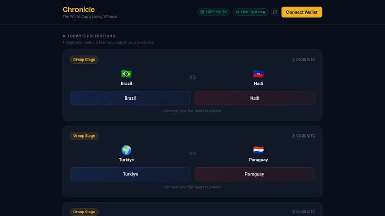

# Chronicle — The World Cup's Living Witness

> *Every prediction, sealed forever. Every match, analysed by AI.*

Chronicle is a decentralised football prediction platform for the **2026 FIFA World Cup**. Users connect their Sui wallet, pick match winners, and their predictions are cryptographically signed and stored **permanently on Walrus mainnet** — the decentralised storage network built on Sui. After each match, Gemini AI generates a theatrical post-mortem that measures community predictions against reality.

Built for the [DeepSurge Hackathon](https://www.deepsurge.xyz/hackathons/cbe3390c-88c1-48c6-a86d-5c1edb4b6d17).

---

## What it does

| Feature | Description |
|---|---|
| **Live match data** | Gemini 2.5 Flash fetches live World Cup scores + schedules daily via Google Search |
| **Sui wallet voting** | Connect any Sui wallet (Slush, Suiet, etc.) and pick a winner before kick-off |
| **Walrus mainnet storage** | Predictions are Ed25519-signed and stored as certified blobs on Walrus mainnet |
| **Community pulse** | Real-time vote split shows who the crowd is backing and why |
| **AI post-mortem** | After each match, Chronicle AI delivers a 200-word tactical breakdown comparing your picks to the result |
| **On-chain explorer** | Every stored prediction links to WalrusScan so you can verify your blob on-chain |

---

## Screenshots

### Today's Predictions — pick your winner before kick-off



*Connect your Sui wallet, select a team, and optionally add a reason. Your prediction is sealed on Walrus mainnet with a cryptographic signature.*

### Community Pulse — see how the crowd is leaning

The live vote-split bar shows percentage backing for each team in real time, plus the 10 most recent community predictions with truncated wallet addresses and Walrus blob IDs.

### AI Post-Mortem — Chronicle analyses the match

After a match ends, click "Chronicle Analysis" for an AI-generated tactical breakdown:

- Opening verdict on the match
- Tactical story: formations, pressing, momentum shifts
- Community accuracy: who predicted right and why
- The single turning point
- What the result means for the tournament

---

## Architecture

```
┌─────────────────────────────────────────────────────────┐
│                    Browser (React + Vite)                │
│  Sui wallet → vote UI → /api/predictions → StorageBadge │
└──────────────────────┬──────────────────────────────────┘
                       │  HTTP (no secrets in browser)
┌──────────────────────▼──────────────────────────────────┐
│               Express API Server (Node.js)               │
│  POST /api/predictions   ←── signs blob (Ed25519)        │
│  POST /api/analysis      ←── Gemini post-mortem          │
│  GET  /api/matches       ←── cached World Cup data       │
└───────┬──────────────────────────────┬───────────────────┘
        │                              │
┌───────▼──────────┐        ┌──────────▼──────────────────┐
│  Walrus Mainnet  │        │   Google Gemini 2.5 Flash    │
│  (blob storage)  │        │   (match data + analysis)    │
│  Memwal relayer  │        └─────────────────────────────-┘
└──────────────────┘
```

**Key security decision:** All private keys (`MEMWAL_PRIVATE_KEY`, `GEMINI_API_KEY`) live **only on the server**. The browser never sees them. Previous versions used Vite's `define` to inject secrets into the JS bundle — that exposed them to anyone who opened DevTools. This version routes all sensitive operations through the API.

---

## Tech stack

| Layer | Technology |
|---|---|
| Frontend | React 19, TypeScript, Vite, Tailwind CSS, Radix UI, Framer Motion |
| Wallet | `@mysten/dapp-kit` — Sui wallet connect (Slush, Suiet, etc.) |
| Backend | Express 5, Node.js 24, pino logging |
| AI | Google Gemini 2.5 Flash (match data via Google Search + post-mortem analysis) |
| Storage | Walrus mainnet via Memwal relayer + direct HTTP publisher |
| Signing | Ed25519 keypair (`@mysten/sui`) — server-side only |
| Monorepo | pnpm workspaces, TypeScript 5.9, esbuild |

---

## How Walrus storage works

Every prediction goes through this pipeline on the server:

```
1. User submits vote → POST /api/predictions
2. Server builds ChronicleBlob { schema, prediction, signer, storedAt }
3. Server signs canonical prediction JSON with Ed25519 key
4. Try Memwal relayer → signed relay to Walrus mainnet
5. Fallback: direct Walrus HTTP publisher (mainnet)
6. Fallback: localStorage ID (never lost)
7. Return { blobId, explorerUrl } → shown in UI as "Sealed on Walrus"
```

The `blobId` is a Sui object reference. Anyone can verify a prediction at:
`https://walruscan.com/mainnet/blob/<blobId>`

---

## Getting started

### Prerequisites

- Node.js 24+
- pnpm 10+
- A Sui wallet (Slush recommended)

### Environment variables

Copy `.env.example` and fill in your values:

```bash
cp .env.example .env
```

```env
# Required — AI for match data and analysis
GEMINI_API_KEY=your_key_here
GEMINI_API_KEY_2=your_backup_key         # optional

# Required — Walrus mainnet storage
MEMWAL_ACCOUNT_ID=0x...
MEMWAL_PRIVATE_KEY=hex_ed25519_key       # NEVER expose to browser
MEMWAL_PUBKEY=hex_ed25519_pubkey
MEMWAL_SERVER_URL=https://relayer.memory.walrus.xyz
```

Get a Gemini key free at [aistudio.google.com](https://aistudio.google.com/app/apikey).  
Set up Memwal at [docs.wal.app](https://docs.wal.app/walrus-memory/getting-started/what-is-memwal).

### Run locally

```bash
# Install
pnpm install

# Start the API server (port 5000 by default)
pnpm --filter @workspace/api-server run dev

# Start the frontend (separate terminal)
pnpm --filter @workspace/chronicle run dev
```

---

## Project structure

```
chronicle-repo/
├── artifacts/
│   ├── chronicle/              # React frontend
│   │   └── src/
│   │       ├── pages/Chronicle.tsx   # Main app UI
│   │       ├── lib/walrus.ts         # Walrus client (no secrets)
│   │       ├── lib/gemini.ts         # Gemini client (no secrets)
│   │       ├── lib/matchData.ts      # Match data types + fallbacks
│   │       └── lib/scoreUpdate.ts    # API fetch + localStorage cache
│   └── api-server/             # Express backend
│       └── src/
│           ├── routes/
│           │   ├── predictions.ts    # POST /api/predictions (signs + stores)
│           │   ├── analysis.ts       # POST /api/analysis (Gemini post-mortem)
│           │   └── matches.ts        # GET /api/matches (Gemini-fetched scores)
│           └── lib/
│               └── matchCache.ts     # Daily World Cup data cache
├── .env.example                # Template — copy to .env
└── .gitignore                  # .env, node_modules, dist, data/
```

---

## Security

| What | How |
|---|---|
| Private key never in browser | All signing happens server-side in `routes/predictions.ts` |
| API keys never in JS bundle | Removed Vite `define` injection; keys only in `process.env` |
| `.env` gitignored | `.gitignore` covers `.env`, `.env.local`, `*.pem`, `*.key` |
| Cryptographic proof | Every blob carries an Ed25519 signature over the prediction JSON |
| Open verification | Anyone can verify a prediction blob on WalrusScan |

---

## Why Walrus?

Traditional prediction apps store votes in a central database — the operator can delete, alter, or fabricate results. Chronicle uses Walrus because:

- **Permanent** — blobs are certified by a quorum of Sui validators
- **Verifiable** — any third party can fetch and verify the blob + signature
- **Censorship-resistant** — no single party controls the data
- **Timestamped** — blob creation is anchored to Sui block time

This makes Chronicle a genuine "living witness" — the community's predictions exist independently of the app itself.

---

## Hackathon submission

**Event:** [DeepSurge Hackathon](https://www.deepsurge.xyz/hackathons/cbe3390c-88c1-48c6-a86d-5c1edb4b6d17)

**What we built:** A real-time, AI-powered World Cup prediction platform where every vote is sealed on Walrus mainnet — giving football fans a permanent, cryptographically provable record of their predictions.

**Walrus integration highlights:**
- Mainnet blob storage via Memwal relayer with Ed25519-signed payloads
- Direct Walrus HTTP publisher fallback (mainnet endpoints)
- WalrusScan explorer links for every stored prediction
- Server-side signing keeps private keys off the browser entirely

**Gemini integration highlights:**
- Google Search grounding for live World Cup scores and schedules (refreshed daily)
- Post-mortem analysis comparing community predictions to actual results
- Dual-key fallback for rate limit resilience
